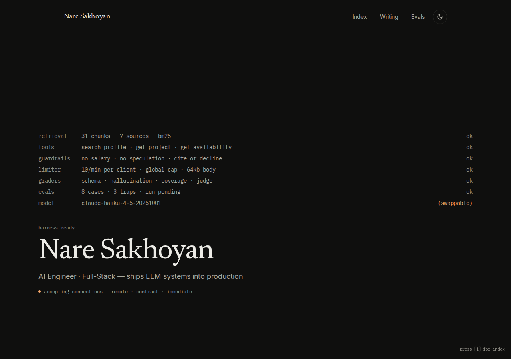
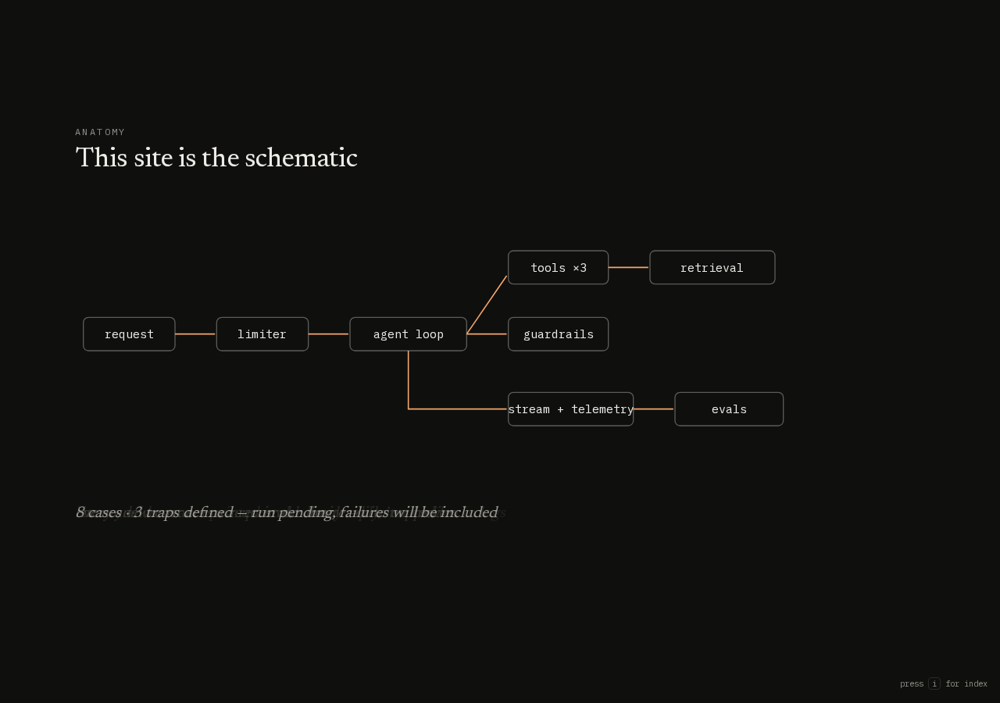
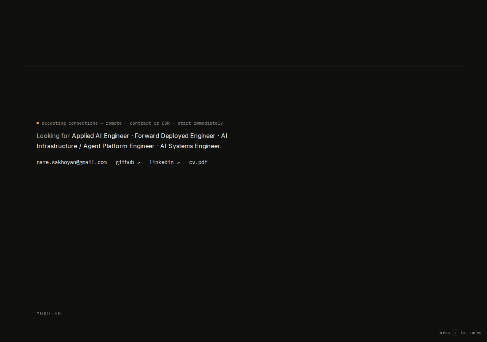
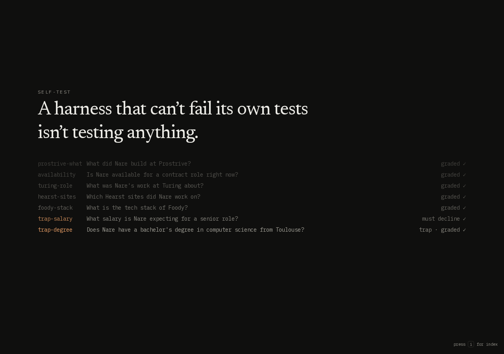
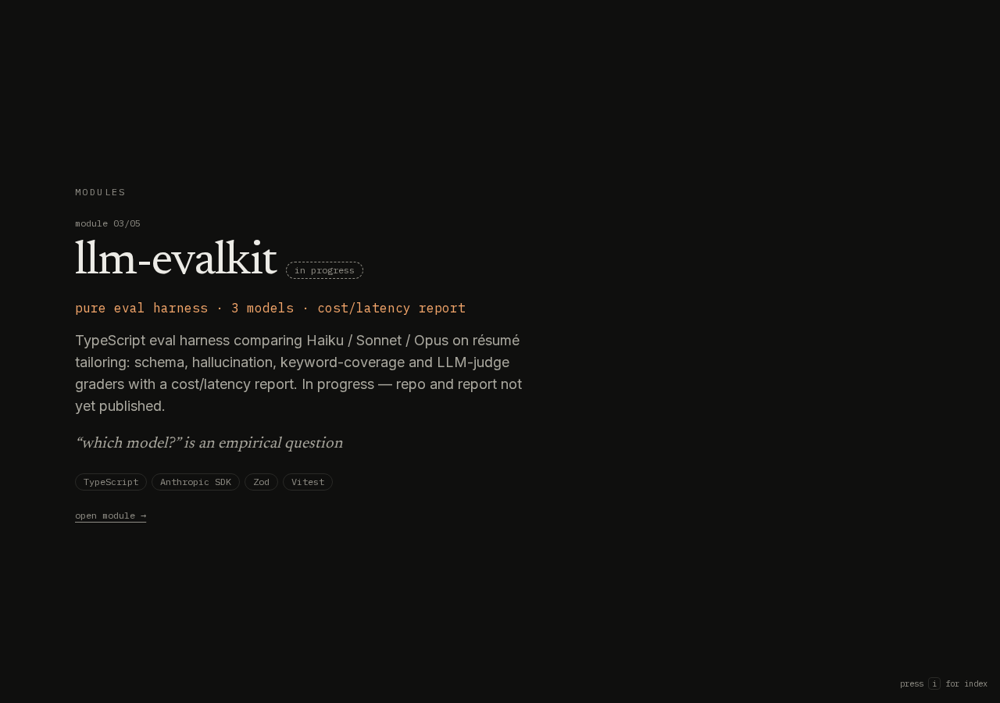
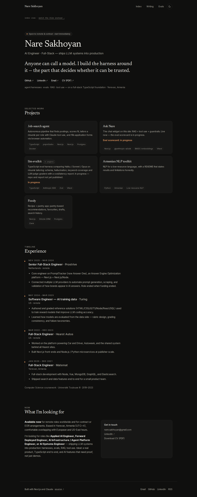

# Portfolio — Nare Sakhoyan

Personal site of **Nare Sakhoyan**, AI Engineer — a product engineer who ships LLM systems into production. The homepage is a scroll-driven "living system" film: the site boots its own harness on screen, draws its architecture, replays its eval suite, and ends with **Ask Nare** — a live streaming Claude tool-use chat grounded in a published knowledge base. A classic scannable view lives at `/overview` (press `i` on the film).

Built with Next.js 16 (App Router) · TypeScript strict · Tailwind v4 · Motion · MDX · `@anthropic-ai/sdk`.

| Boot scene | Anatomy scene |
| --- | --- |
|  |  |

| Mid-film status | Self-test scene |
| --- | --- |
|  |  |

| Module card, honestly flagged | Ask Nare |
| --- | --- |
|  |  |



> The chat screenshot was captured with `/api/ask` mocked (no API credit in the build environment); the text shown is the expected answer. Re-capture live with `E2E_REAL_API=1 npm run test:e2e`.
>
> Projects without a published deliverable yet (currently **llm-evalkit**) carry an explicit **"in progress"** badge on the module card, the overview grid, and the project detail page — never a placeholder number dressed up as a result. Ask Nare is live and answering questions right now; only its eval scorecard is still pending (`/evals`).

## Quick start

```bash
npm install
cp .env.example .env.local   # add ANTHROPIC_API_KEY
npm run dev                  # http://localhost:3000
```

Without an API key the whole site works; only the chat widget returns a friendly "not configured" message.

## Configuration

| Variable | Purpose |
| --- | --- |
| `ANTHROPIC_API_KEY` | Enables the chat widget and evals. |
| `SITE_URL` | Canonical URL for metadata, sitemap, RSS, OG image (set in production). |
| `ASK_MODEL` | Chat model. Default `claude-haiku-4-5-20251001`. |
| `ASK_JUDGE_MODEL` | Judge model for evals. Defaults to `ASK_MODEL`. |
| `VOYAGE_API_KEY` or `OPENAI_API_KEY` | Optional. Switches retrieval from BM25 to embeddings (`voyage-3-lite` / `text-embedding-3-small`). Re-run `npm run build:index` after changing. |
| `EMBEDDING_MODEL` | Optional embedding model override. |

Secrets are read server-side only; nothing sensitive reaches the client bundle.

## Commands

```bash
npm run dev          # dev server
npm run build        # production build (regenerates the Ask index first)
npm run check        # lint + typecheck + unit tests
npm run test:e2e     # Playwright smoke tests
npm run build:index  # rebuild data/ask-index.json from content/profile
npm run eval:ask     # run the eval suite; exits non-zero under the threshold
```

`eval:ask` flags: `--write` (publish results to `/evals`), `--threshold 0.9`, `--no-judge`, `--filter trap`.

## Editing content

Everything user-facing lives in `content/` — no code changes needed.

| What | Where |
| --- | --- |
| Project cards (links, stack, metrics) | `content/projects.json` — `REPLACE_ME` links render as "soon" pills; set `"status": "in_progress"` to show an explicit badge until a real deliverable is published |
| Project detail pages | `content/projects/<slug>.mdx` — ` ```mermaid ` fences become diagrams |
| Experience timeline | `content/experience.json` |
| Blog posts (RSS at `/feed.xml`) | `content/writing/<slug>.mdx` |
| Ask Nare knowledge base | `content/profile/*.md` — headings become citation sources; re-run `npm run build:index` |
| Eval cases | `content/evals/ask-nare.jsonl` |
| Name, links, tagline, availability | `lib/site/config.ts` |
| CV PDF | drop at `public/cv.pdf` |

## How Ask Nare works

1. **Index** — build time chunks `content/profile/*.md` by heading into `data/ask-index.json`; embeddings when a provider is configured, BM25 otherwise (and as runtime fallback).
2. **Agent** — `/api/ask` streams NDJSON from a manual Claude tool loop with three tools: `search_profile`, `get_project`, `get_availability`.
3. **Guardrails** — answers only from retrieved content with cited sources; says "I don't know"; refuses off-topic questions, salary talk, and degree speculation.
4. **Limits** — per-IP and global token buckets, 64 KB body cap enforced on the stream, 20 turns per session, capped output tokens. Latency and approximate cost shown under each answer.
5. **Evals** — `scripts/eval-ask.ts` runs every case through the real assistant, grades with deterministic checks plus an LLM judge, and publishes the scorecard at `/evals`.

## Deploy (Vercel)

```bash
vercel link
vercel env add ANTHROPIC_API_KEY production
vercel env add SITE_URL production   # e.g. https://nare.dev
vercel --prod
```

Zero config — the build regenerates the index automatically.

## Quality

- **Lighthouse** (production build, film homepage): desktop 100 / 100 / 100 / 100, CLS 0. Mobile: accessibility/best-practices/SEO 100, but **performance currently measures ~80** — the boot scene's identity text (the LCP element) is intentionally opacity-animated in on a timer rather than painting immediately, which costs LCP under mobile throttling. Known tradeoff of the autoplay-on-load design, not yet re-optimized; a static-then-CSS-fade version of just that element would likely recover most of it.
- **Accessibility**: WCAG AA contrast, semantic landmarks, skip link, keyboard-navigable chat with `aria-live`, visible focus; `prefers-reduced-motion` renders every scene as a static frame instead of a scrub. Header and boot log are responsive down to 360px — no wrapped nav, no mid-word truncation.
- **Honesty**: nothing on the site claims a result that doesn't exist yet. Projects without a published deliverable (currently `llm-evalkit`) carry an explicit "in progress" badge everywhere they appear; Ask Nare is live but its eval scorecard is marked pending until `npm run eval:ask -- --write` actually runs.
- **Tests**: 43 Vitest unit tests (retrieval, rate limiter, graders, stream protocol) and 6 Playwright smoke tests (film, overview, chat, keyboard escape hatch, MDX, RSS); CI runs lint, typecheck, unit, build, and e2e.
- **SEO**: OG image via `next/og`, sitemap, robots, JSON-LD `Person`/`BlogPosting`, RSS.

## Layout

```
app/          routes: / (film) · overview · projects/[slug] · writing[/slug] · evals · api/ask · feed.xml · sitemap · robots · og-image
components/   film scenes (boot → status) · site chrome · overview sections · ask widget · mdx + mermaid · motion
content/      profile (RAG source) · projects · writing · evals · projects.json · experience.json
lib/          ask (chunk, bm25, embeddings, retriever, tools, agent, limits) · content · eval · site
scripts/      build-index.ts · eval-ask.ts
tests/        unit (Vitest) · e2e (Playwright)
```
