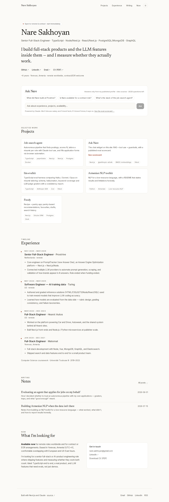
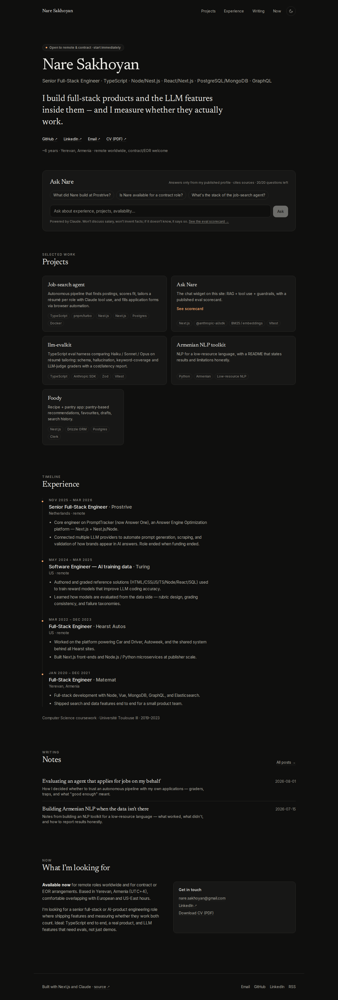
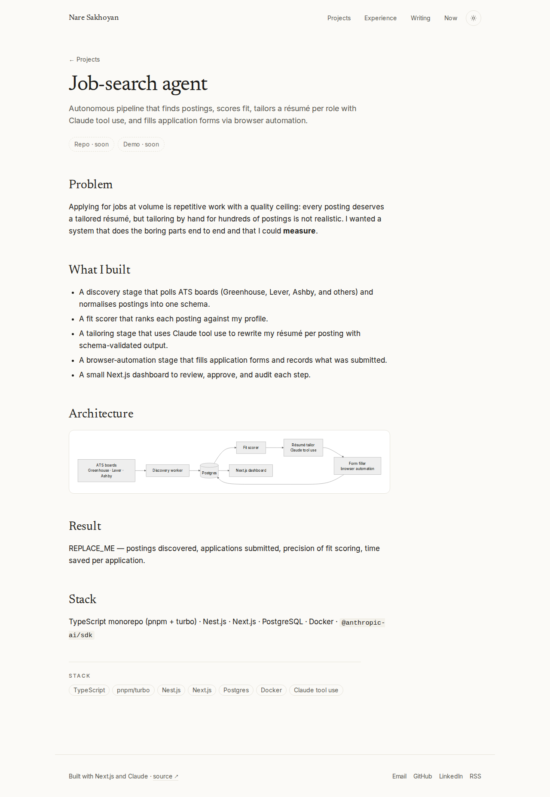
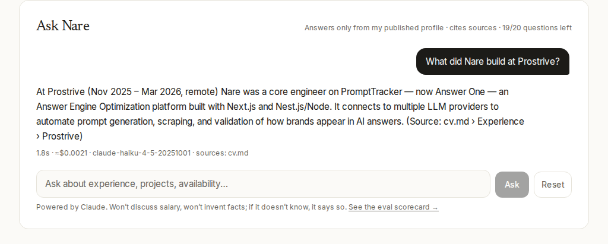

# nare.dev — portfolio

Personal site of **Nare Sakhoyan**, Senior Full-Stack Engineer. Next.js 16 (App Router) · TypeScript strict · Tailwind v4 · MDX · an embedded **Ask Nare** RAG assistant built on `@anthropic-ai/sdk` with a published eval scorecard.

| Home (light) | Home (dark) |
| --- | --- |
|  |  |

| Project page | Ask Nare answering "What did Nare build at Prostrive?" |
| --- | --- |
|  |  |

> The chat screenshot was captured with the `/api/ask` route **mocked** (the build environment's Anthropic key had no credit). The rendered answer text is the expected answer for that question; re-capture it against the live API with `E2E_REAL_API=1 npm run test:e2e` once a funded key is configured.

## Quick start

```bash
npm install
cp .env.example .env.local      # add ANTHROPIC_API_KEY
npm run build:index             # chunk content/profile → data/ask-index.json (BM25; embeddings if a key is set)
npm run dev                     # http://localhost:3000
```

## Environment variables

| Variable | Required | Purpose |
| --- | --- | --- |
| `ANTHROPIC_API_KEY` | yes (for the widget + evals) | Claude API key. Without it `/api/ask` returns a friendly 503 and the rest of the site works. |
| `ASK_MODEL` | no | Chat model. Default `claude-haiku-4-5-20251001`. |
| `ASK_JUDGE_MODEL` | no | LLM-judge model for evals (defaults to `ASK_MODEL`). |
| `VOYAGE_API_KEY` / `OPENAI_API_KEY` | no | Enables embedding retrieval (`voyage-3-lite` / `text-embedding-3-small`). If neither is set, BM25 keyword search is used. Re-run `npm run build:index` after changing. |
| `EMBEDDING_MODEL` | no | Override the embedding model name. |
| `SITE_URL` | recommended in prod | Canonical URL for metadata, sitemap, RSS, OG image. |

Secrets are only read server-side (route handler / scripts); nothing sensitive is bundled for the client.

## Scripts

| Command | What it does |
| --- | --- |
| `npm run dev` / `build` / `start` | Next.js. `prebuild` regenerates the Ask index automatically. |
| `npm run lint` · `npm run typecheck` · `npm test` | ESLint · `tsc --noEmit` · Vitest unit tests (retrieval, BM25, rate limiter, graders, stream protocol, request schema). |
| `npm run test:e2e` | Playwright smoke: home loads, chat answers a known question (mocked stream unless `E2E_REAL_API=1`), project page renders incl. Mermaid, writing + RSS. |
| `npm run build:index` | Chunk `content/profile/*.md` (+ embed if configured) → `data/ask-index.json`. |
| `npm run eval:ask` | Run `content/evals/ask-nare.jsonl` through the real assistant + deterministic checks + LLM judge; prints a scorecard; exits 1 under the threshold. Flags: `--write` (update `content/evals/scorecard.json`, shown at `/evals`), `--threshold 0.9`, `--no-judge`, `--filter trap`. |
| `npm run check` | lint + typecheck + unit tests (what CI runs, plus build + e2e). |

## Editing content

Everything user-facing lives under `content/` — no code changes needed.

| What | Where |
| --- | --- |
| Project cards (title, summary, stack, links, metric) | `content/projects.json` — `links` values starting with `REPLACE_ME` render as disabled "soon" pills. |
| Project detail pages (problem · what I built · architecture · result · stack) | `content/projects/<slug>.mdx` — ```` ```mermaid ```` fences render as diagrams (client-side, lazy-loaded). |
| Experience timeline | `content/experience.json` |
| Blog posts | `content/writing/<slug>.mdx` with `title`, `date`, `summary`, `draft` frontmatter. RSS at `/feed.xml`. |
| Ask Nare knowledge base | `content/profile/*.md` (`cv.md`, `facts.md`, `project-<slug>.md`). Headings become citation sources ("cv.md › Experience › Prostrive"). Run `npm run build:index` after edits (also runs on build). |
| Eval cases | `content/evals/ask-nare.jsonl` — fields: `id`, `question`, `mustInclude[]`, `mustNotInclude[]`, `expectRefusal`, `rubric`. |
| Name, links, tagline, availability badge | `lib/site/config.ts` |
| CV PDF | drop it at `public/cv.pdf` (not included — the hero and "Now" section link to `/cv.pdf`) |

## How Ask Nare works

- **Retrieval** — build-time chunking by heading; cosine search over stored embeddings when a provider is configured, otherwise BM25 (`lib/ask/retriever.ts`). Falls back to BM25 at request time if the embedding call fails.
- **Tools** — `search_profile(query)`, `get_project(slug)`, `get_availability()` (`lib/ask/tools.ts`), executed in a streaming manual tool loop (`lib/ask/agent.ts`, max 4 tool rounds).
- **Guardrails** — system prompt in `lib/ask/prompt.ts`: answer only from tool output, cite sources, say "I don't know", refuse off-topic, never state salary, never speculate about degree completion.
- **Limits** — in-memory token bucket per IP (10 burst, ~10/min) plus a global per-instance bucket (60/min) that bounds spend even if forwarded-for headers are spoofed; body capped at 64 KB on the actual stream; 20 user turns per session (enforced client- and server-side), 2000 chars per message, 700 output tokens.
- **Transparency** — each answer shows latency, approximate cost (from token usage × model price table in `lib/ask/models.ts`), model, and source files.
- **Evals** — `scripts/eval-ask.ts`; scorecard published at `/evals`.

## Deploy to Vercel

```bash
npm i -g vercel
vercel link
vercel env add ANTHROPIC_API_KEY production
vercel env add SITE_URL production            # e.g. https://nare.dev
# optional: vercel env add VOYAGE_API_KEY production
vercel --prod
```

Zero config: `next build` runs `prebuild` to regenerate the index. Add a custom domain in the Vercel dashboard and set `SITE_URL` to match.

## Quality bar (measured)

- Lighthouse 12 on the production build of `/` (local `next start`, headless Chromium):
  - Desktop preset: Performance **100** · Accessibility **100** · Best Practices **100** · SEO **100** (LCP 0.5–0.8 s, CLS 0, TBT ≤ 20 ms).
  - Mobile (default throttling): Performance **96–97** · Accessibility 100 · Best Practices 100 · SEO 100 (LCP 2.2–2.7 s, CLS 0). Re-run with `npx lighthouse http://localhost:3000/ --preset=desktop`.
- WCAG AA contrast in both themes, semantic landmarks, skip link, keyboard-navigable chat (Enter to send, Shift+Enter newline), `aria-live` log, visible focus rings, `prefers-reduced-motion` respected.
- OpenGraph image via `next/og`, sitemap, robots, JSON-LD `Person` + `BlogPosting`, RSS.

## Project layout

```
app/            routes: / · /projects/[slug] · /writing · /writing/[slug] · /evals · /api/ask · feed.xml · sitemap · robots · opengraph-image
components/     site (header/footer/theme) · home sections · ask widget · mdx (+ mermaid) · motion
content/        profile/ (RAG knowledge) · projects/ (MDX) · writing/ (MDX) · evals/ · projects.json · experience.json
lib/            ask/ (chunk, bm25, embeddings, retriever, tools, agent, rate-limit, models) · content/ · eval/ · site/
scripts/        build-index.ts · eval-ask.ts
tests/          unit/ (Vitest) · e2e/ (Playwright)
data/           ask-index.json (generated)
```
