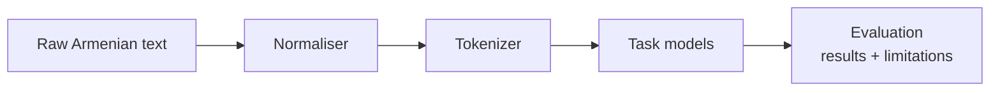

## Problem

Armenian has little labeled data and few off-the-shelf tools. Most NLP work assumes a resource-rich language; I wanted to see how far you can get when the data isn't there, and to document the gaps instead of hiding them.

## What I built

REPLACE_ME — tokenizer, normaliser, and task heads; a results table and a limitations section in the README.

## Architecture

## Result

REPLACE_ME — results table.

## Stack

Python · REPLACE_ME
