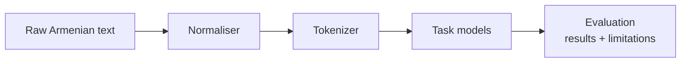

## Problem

Armenian has little labeled data and few off-the-shelf tools. Most NLP work assumes a resource-rich language; I wanted to see how far you can get when the data isn't there, and to document the gaps instead of hiding them.

## What I built

> **Status: write-up in progress.** The toolkit covers normalisation, tokenization, and task models; the repo README — with its results table and limitations section — is the source of truth until this page catches up.

## Architecture

## Result

See the results table and, just as importantly, the limitations section in the repo README. I publish both together: a results table without a limitations table is an advertisement.

## Stack

Python
