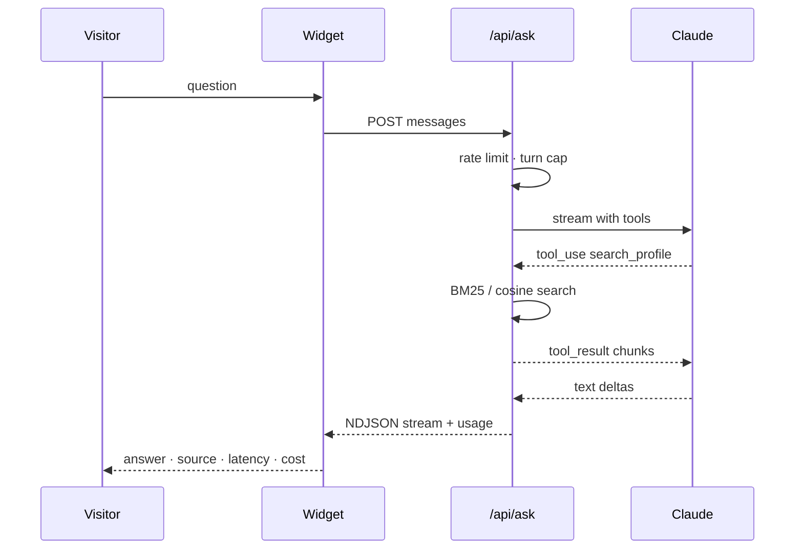

## Problem

A portfolio is static; recruiters have specific questions. I wanted a widget that answers them **only** from what I have actually written down, refuses politely when it should, and proves it with a scorecard instead of a promise.

## What I built

- Knowledge base: `content/profile/*.md` chunked at build time. Embeddings (Voyage or OpenAI) when a key is configured, BM25 keyword search otherwise — so it runs with only `ANTHROPIC_API_KEY`.
- Tools exposed to the model: `search_profile(query)`, `get_project(slug)`, `get_availability()`.
- System-prompt guardrails: answer only from retrieved content, cite the section, say "I don't know" when the content doesn't cover it, decline off-topic requests, never state salary, never speculate about degree completion.
- Rate limit by IP (token bucket), 20 turns per session, capped output tokens. Latency and approximate cost under each answer.
- `npm run eval:ask` runs `content/evals/ask-nare.jsonl` through deterministic checks and an LLM judge and fails under a threshold.

## Architecture

## Result

See the [eval scorecard](/evals). Try it on the [home page](/#ask).

## Stack

Next.js route handler · `@anthropic-ai/sdk` · TypeScript · Vitest
