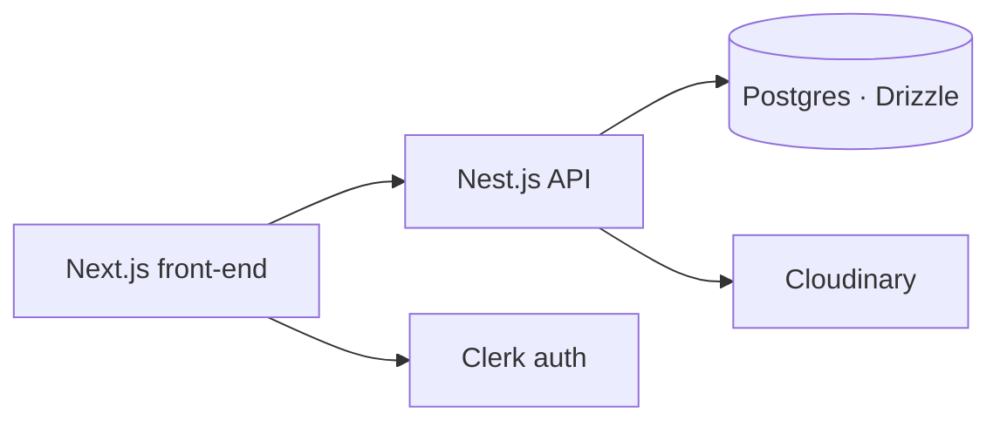

## Problem

Decide what to cook from what is already in the kitchen, and keep a personal recipe collection that is pleasant to maintain.

## What I built

- Nest.js API with Drizzle ORM on Postgres, Clerk authentication, Cloudinary image uploads.
- Next.js front-end: pantry management, pantry-based recipe recommendations, favourites, drafts, and search history.

## Architecture

## Result

A working two-repo app I use as a reference implementation for auth, uploads, and ORM patterns.

## Stack

Nest.js · Drizzle ORM · PostgreSQL · Clerk · Cloudinary · Next.js
