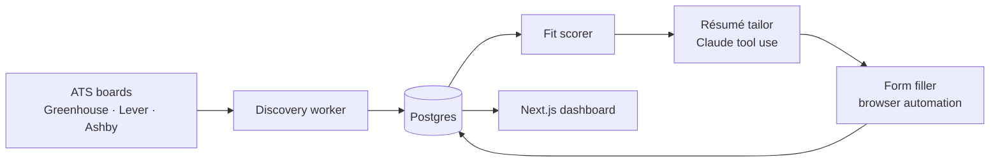

## Problem

Applying for jobs at volume is repetitive work with a quality ceiling: every posting deserves a tailored résumé, but tailoring by hand for hundreds of postings is not realistic. I wanted a system that does the boring parts end to end and that I could **measure**.

## What I built

- A discovery stage that polls ATS boards (Greenhouse, Lever, Ashby, and others) and normalises postings into one schema.
- A fit scorer that ranks each posting against my profile.
- A tailoring stage that uses Claude tool use to rewrite my résumé per posting with schema-validated output.
- A browser-automation stage that fills application forms and records what was submitted.
- A small Next.js dashboard to review, approve, and audit each step.

## Architecture

## Result

> **Status: pipeline running; write-up in progress.** The numbers I'm collecting — postings discovered, applications submitted, fit-score precision, time saved per application — land here once there's enough volume to report honestly.

## Stack

TypeScript monorepo (pnpm + turbo) · Nest.js · Next.js · PostgreSQL · Docker · `@anthropic-ai/sdk`
