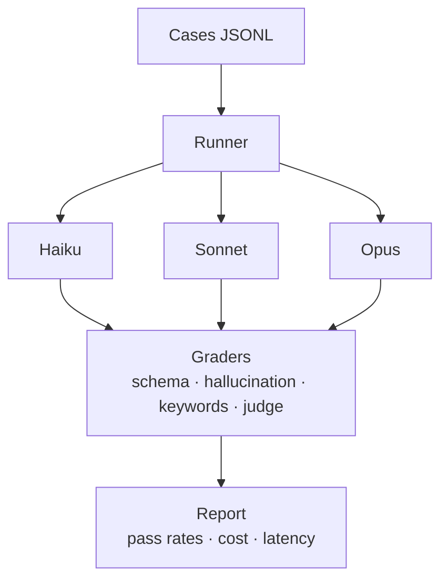

## Problem

"Which model should I use for résumé tailoring?" is an empirical question, not a vibes question. I needed a harness that answers it with graders I can defend and a cost/latency report I can act on.

## What I built

- A dataset of posting + profile pairs and the expected tailored output shape.
- Four graders: **schema** (does output validate?), **hallucination** (does it invent facts not in the source profile?), **keyword coverage** (are the posting's required keywords present?), and **LLM judge** (rubric-based quality score).
- A runner that executes the same cases across Haiku, Sonnet, and Opus and produces a cost/latency report.

## Architecture

## Result

| Model | Schema | Hallucination-free | Keyword coverage | Judge | Cost / case | p50 latency |
| --- | --- | --- | --- | --- | --- | --- |
| Haiku | REPLACE_ME | REPLACE_ME | REPLACE_ME | REPLACE_ME | REPLACE_ME | REPLACE_ME |
| Sonnet | REPLACE_ME | REPLACE_ME | REPLACE_ME | REPLACE_ME | REPLACE_ME | REPLACE_ME |
| Opus | REPLACE_ME | REPLACE_ME | REPLACE_ME | REPLACE_ME | REPLACE_ME | REPLACE_ME |

## Stack

TypeScript · `@anthropic-ai/sdk` · Zod · Vitest
